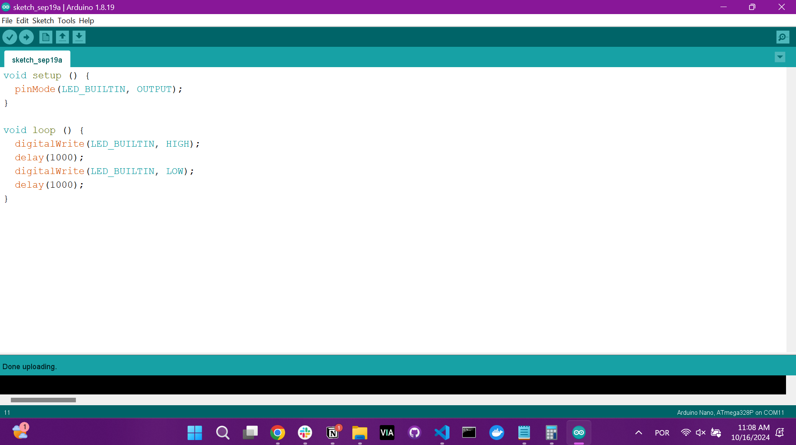

# Ponderada de Programação - Blink

Esta atividade ponderada foi realizada pela aluna Kethlen Martins da Silva (ateliê 1) para a disciplina de Programação, cuja professora instrutora é Kizzy Terra. A ponderada faz parte do módulo 4 (projeto de IoT) do Instituto de Tecnologia e Liderança e contém duas entregas:

1. Entrega do blink (pisca-pisca) do Led_bultin do Arduino Uno, junto do código e imagens comprobatórias.
2. Simulação de pisca-pisca no Tinkercad.

## Entrega 1

Para a primeira entrega da ponderada, foi necessário conectar o Arduino Uno ao computador e utilizar a Arduino IDE para controlar o led interno.

    Conexão do Arduino Uno ao computador   

  
   
   Fonte: Material produzido pelos autores (2024)

    Código utilizado   

  
   
   Fonte: Material produzido pelos autores (2024)

    Vídeo demonstrativo   

  https://github.com/user-attachments/assets/9383b351-42d6-467c-b97a-937e19bdfa3c
   
   Fonte: Material produzido pelos autores (2024)

## Entrega 2

Para a segunda entrega da ponderada, foi necessário criar um circuito pisca-pisca de leds externos no Tinkercad.

Para a criação do circuito, foram necessários:
- Arduino Uno,
- Leds externos,
- Resistores,
- Fios jumper.

    Conexão do Arduino Uno ao computador   

  
   
   Fonte: Material produzido pelos autores (2024)

É possível acessar o circuito diretamente no Tinkercad através do seguinte link: 
[Projeto no Tinkercad](https://www.tinkercad.com/things/3XIDnIbKUql/editel?sharecode=RKbRP9iHrteQ3DBW75hSTp2ZGixJoLg0Xv9SsljELb0)
